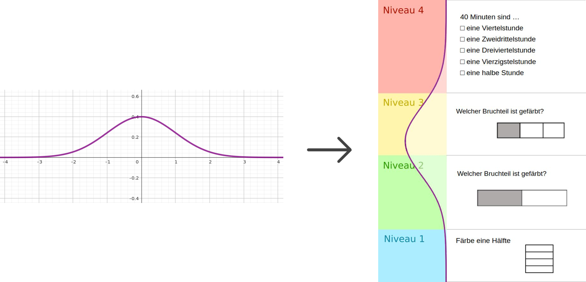
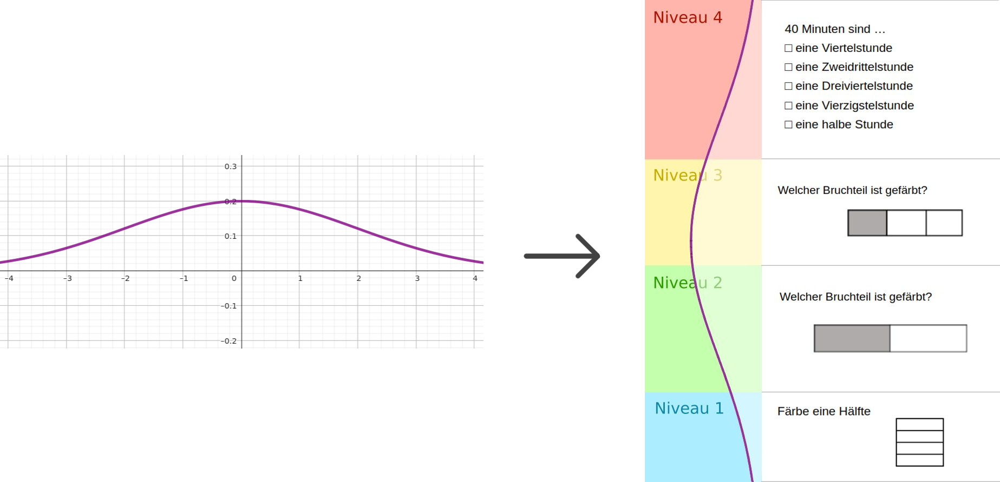
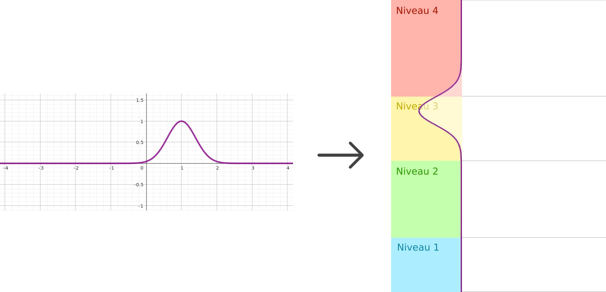

# README

## Dokumentation - Konfiguration der Anforderungsstufenansicht in der Testschnittstelle

### Kontext

Dieses Dokument beschreibt wie für die Auswertung der Testergebnisse eine Ansicht konfiguriert werden kann welche die Anforderungsstufen innerhalb eines Tests darstellt.

Die Konfiguration solcher Ansichten geschieht allgemein über die `test.json`-Datei eines Tests, siehe die [Dokumentation der Test-Schnittstelle](../testschnittstelle.md).

Der für die hier dokumentierte Ansicht relevante Teil ist der Inhalt des `niv_config`-Knotens:

- ...
- `configuration`
  - `views`
    - `type`: Text, aktuell werden `table`, `bar`, `graph_table`, `graph` und `niveau` unterstützt
    - `niv_config`: Objekt, Konfiguration für den Fall, dass `type` = `niveau`
- ...

### Konfigurationsoptionen

Hier können nun folgende Felder angelegt werden:

- `example_texts`: Array von Arrays, welche Texte von Beispielaufgaben eines bestimmten Niveaus enthalten (Hinweis: ⌹ wird als Bruchzeichen verwendet; Beispiel: der Bruch `1/4` muss so geschrieben werden, falls es als Bruch dargestellt werden soll: `1⌹4`)
- `headlines`: Array aus Texten, je eine Niveaubeschreibung für jedes Niveau
- `explanations`: Array aus Texten, je eine längere Niveaubeschreibung für jedes Niveau (optional)
- `heights`: Array aus Texten, jeder Text enthält den prozentualen Anteil eines Niveaus (Beispiel: `["41.555%","24.754%","33.691%"]`)
- `normal_mean`: Zahl, Mittelwert einer visuell über die Niveaustufen gelegten Normalverteilung, welche die Verteilung der Schüler-Personenparameter in der Stichprobe visualisieren soll. Die Abszisse umfasst dabei den Bereich von -4 bis 4, wobei -4 der Beginn des untersten Niveaus und 4 das Ende des obersten Niveaus ist
- `normal_sd`: Zahl, Standardabweichung ebendieser Normalverteilung

Dabei ist zu beachten, dass die Inhalte übergebener Arrays visuell von unten nach oben hin dargestellt werden, mit dem
ersten Eintrag, der niedrigsten Anforderungsstufe, zuunterst und dem letzten Eintrag ganz oben.

### Beispiele zur Konfiguration der gezeigten Normalverteilung

Zur besseren Verdeutlichung der Konfiguration der präsentierten Normalverteilung hier drei Beispiele:

#### 1. Fall: `normal_mean = 0`, `normal_sd = 1`

#### 2. Fall: `normal_mean = 0`, `normal_sd = 2`

#### 3. Fall: `normal_mean = 1`, `normal_sd = 0.4`

